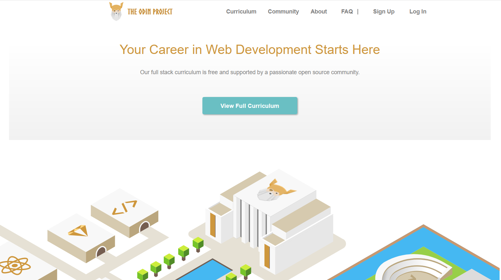

# Grid-Based-Framework

* [About](#about)
* [How it works](#how-it-works)
* [Technologies](#technologies)
* [Acknowledgements](#acknowledgements)
* [About Us](#about-us)

## About



## How It Works

If you're familiar with the Bootstrap framework, this framework works in a similar way. Set a container element using the class 'row', and then set each of it's child elements classes based on the amount of rows you want at different sizes.

```
<div class='row'>
    <div class='col-sm-12 col-md-6 col-lg-4'>
        Full width at less than 720px,
        half width at greater than 720px,
        1/3rd width at greater than 1024px
    </div>
    <div class='col-sm-12 col-md-6 col-lg-4'>
        Full width at less than 720px,
        half width at greater than 720px,
        1/3rd width at greater than 1024px
    </div>
</div>
```

The above code will create a row, 100% width of it's container, with two divs that change their sizing responsively based on the three breakpoints set in the framework.
Small: Less than 720px. (col-sm-#)
Medium: Greater than 720px and less than 1024px. (col-md-#)
Large: Greater than 1024px. (col-lg-#)

This framework also contains functions for controlling text alignment within a container:

```
Left: .txt-left
Right: .txt-right
Center: .txt-center
```

As well as a function to make a container flex and centered (justify and align):

```
.makeFlex
```

You can also use this framework to hide/show elements at certain viewport widths:

```
.hide-sm & .hide-md
```

hide-sm will hide an element at anything below 720px, and reveal them above 720px, while hide-md will hide elements below 1024px, and reveal them above 1024px.

## Technologies

content

## Acknowledgements 

content

## About Us

content